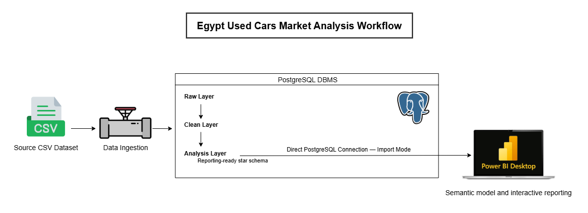
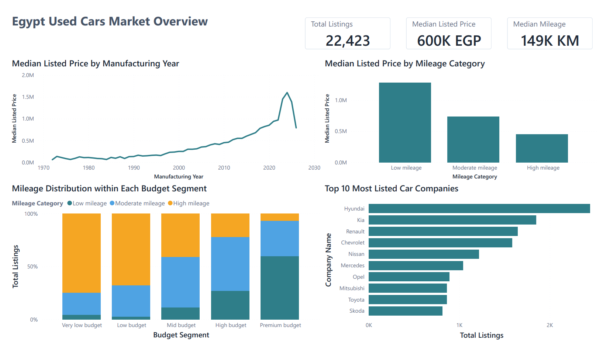

# Egypt Used Cars Market Analysis

An end-to-end analytics project for Egypt’s used-car market, built with PostgreSQL, SQL, dimensional modeling, and Power BI.

The solution transforms raw marketplace listings into a validated reporting layer and interactive views for budget exploration, comparable-car benchmarking, and asking-price evaluation.

> **Limitation:** The analysis is based on listed asking prices, not actual sale prices.

## Project Workflow

| Layer | Purpose |
|---|---|
| `raw` | Preserve source values and load metadata |
| `clean` | Create typed analytical fields, quality flags, and an `is_analysis_ready` filter |
| `analysis` | Store reporting dimensions, the listed-car fact table, and the listing-feature bridge table |
| Power BI | Provide reusable measures and interactive buyer and seller views |

## Reporting-Ready Star Schema

## Power BI Report

- [View the full exported report](power_bi/egypt_used_cars_market_analysis_report.pdf)
- [Open the Power BI source file](power_bi/egypt_used_cars_market_analysis.pbix)

The report includes four pages:

| Page | Purpose |
|---|---|
| Market Overview | Explore listing volume, median price, mileage patterns, budget segments, and the most listed companies |
| Buyer Budget Explorer | Identify affordable listings, common company/model options, locations, and features within a selected budget |
| Buyer Car Benchmark | Compare a selected car with similar listings using quartiles, price boundaries, features, and locations |
| Listing Price Evaluator | Evaluate a selected asking price and return a pricing position with buyer and seller interpretations |

## Dataset

The source dataset contains **24,688** used-car listings from the Egyptian market and is available on Kaggle:

[Used Cars in Egypt 2025 Dataset](https://www.kaggle.com/datasets/mohamedsewid/used-cars-in-egypt-2025/data)

Each row represents one listed car and includes fields such as company, model, manufacturing year, mileage, listed price, color, transmission, location, features, and listing link.

After cleaning and validation, **22,423** listings were marked as analysis-ready.

## Key Business Questions

1. How do manufacturing year and mileage category relate to listed-price benchmarks?
2. Which company/model combinations are common within each budget segment?
3. What is a reasonable listed-price benchmark for a selected car?
4. Which features are common within a comparable group?
5. Where are similar or affordable listings most available?
6. How does a selected asking price compare with the benchmark for similar listings?

## Tools Used

- PostgreSQL
- pgAdmin
- SQL
- Power BI
- DAX
- Excel