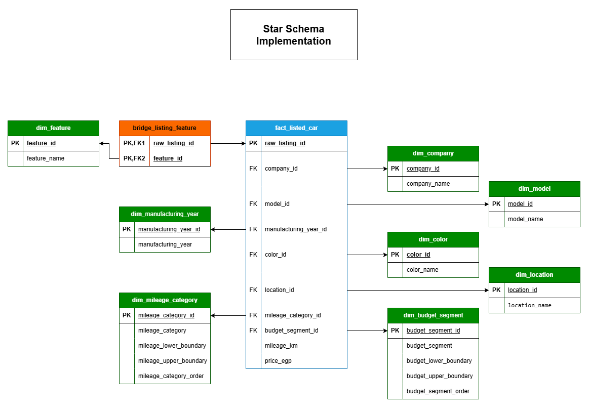

# Egypt Used Cars Market Analysis

This project analyzes used-car listings in the Egyptian market to understand how listed prices vary by manufacturing year, mileage, budget segment, location, and common company/model combinations.

The goal is to transform raw used-car marketplace listings into reliable, analysis-ready data, answer buyer and seller business questions using SQL, and prepare a reporting-ready model for an interactive Power BI dashboard.

> **Important limitation:** this project analyzes listed asking prices, not confirmed sold prices.

## SQL Data Preparation Workflow

## Analysis Star Schema

## Project Roadmap

- [x] Phase 1 — SQL analysis: raw import, data quality checks, clean layer, validation, and business analysis
- [x] Phase 2 — Data modeling: reporting-ready star schema in the `analysis` schema
- [ ] Phase 3 — Power BI dashboard: interactive buyer and seller views

## Dataset

The dataset contains used-car listings from the Egyptian market and is available on Kaggle:

[Used Cars in Egypt 2025 Dataset](https://www.kaggle.com/datasets/mohamedsewid/used-cars-in-egypt-2025/data)

Each row represents one listed car and includes fields such as company, model, manufacturing year, mileage, listed price, color, transmission, location, features, and listing/detail link.

## Tools Used

- PostgreSQL
- pgAdmin
- SQL
- Git / GitHub
- Excel

## Key Findings

### 1. Manufacturing year and mileage category provide useful listed-price benchmarks

Listed-price benchmarks vary clearly across manufacturing year and mileage category. Newer cars and lower-mileage groups generally show higher median listed prices, while older and higher-mileage groups generally show lower benchmarks.

Groups with fewer than five listings were excluded from the official benchmark output to avoid weak comparisons based on very small samples.

### 2. Budget segments reveal realistic company/model options for buyers

Each budget segment has a distinct set of common company/model combinations. This helps buyers understand realistic market options instead of relying only on price ranges.

Examples include Daewoo Lanos and Daewoo Nubira in the very-low budget segment, Nissan Sunny and Chevrolet Optra in the low-budget segment, Hyundai Elantra and Mitsubishi Lancer in the mid-budget segment, and Mercedes C/E models in the premium segment.

### 3. Selected-car benchmarks can support buyer and seller pricing decisions

For selected comparable listings, the project calculates quartile-based listed-price benchmarks using company, model, manufacturing year, and mileage category.

For example, Nissan Sunny 2014 with moderate mileage had 14 comparable listings, with a median listed price of 452,500 EGP and an observed comparable range from 400,000 to 560,000 EGP.

The pricing guide translates these benchmarks into buyer/seller zones such as aggressive pricing, competitive-normal pricing, upper-normal pricing, and premium/patient pricing.

### 4. Feature analysis shows what is common within comparable listings

The feature bridge table supports analysis of common features within a selected comparable group.

For Nissan Sunny 2014 with moderate mileage, Automatic appeared in 71.43% of comparable listings, while Air Conditioner and Remote Control each appeared in 35.71%. This helps buyers understand which features are commonly available within a specific comparable group.

### 5. Location analysis highlights differences in availability and listed-price benchmarks

Listing availability differs strongly by location. Cairo had the highest number of analysis-ready listings, followed by Tagamo3 - New Cairo, 6 October, Alexandria, and Nasr city.

Location-level benchmarks include listing count, minimum listed price, average listed price, median listed price, maximum listed price, median mileage, and median manufacturing year. Locations with fewer than 20 listings were excluded from the official benchmark output to avoid weak comparisons.

### 6. Data quality handling supports trust in the findings

The analysis is based on an analysis-ready dataset of 22,423 listings. Raw data issues such as invalid years, suspicious prices, suspicious mileage values, duplicate listing links, and suspicious locations were handled through quality flags rather than silent deletion.

This keeps the analysis auditable and makes the limitations visible.

## Result Screenshots

Screenshots of the final SQL query outputs are stored in `assets/query_outputs/`

## Detailed Documentation

This README summarizes the main project workflow, findings, and outputs. Detailed design decisions, validation checks, data quality findings, star schema design, and analysis interpretation are documented in the `docs/` folder.

## Project Files

### SQL Scripts

Run these files in order to reproduce the database workflow.

| Order | File | Purpose |
|---:|---|---|
| 1 | `sql/00_database_setup.sql` | Create the database and schemas |
| 2 | `sql/01_create_raw_table.sql` | Create the raw landing table |
| 3 | `sql/02_import_raw_data.sql` | Import the CSV into PostgreSQL |
| 4 | `sql/03_raw_data_quality_checks.sql` | Profile raw data quality issues |
| 5 | `sql/04_create_clean_table.sql` | Create the clean analysis table |
| 6 | `sql/05_insert_clean_data.sql` | Insert, clean, flag, and validate records |
| 7 | `sql/06_analysis_questions.sql` | Answer business questions from the clean layer |
| 8 | `sql/07_create_star_schema.sql` | Create the analysis/reporting star schema |
| 9 | `sql/08_insert_star_schema.sql` | Populate the star schema from the clean layer |
| 10 | `sql/09_star_schema_analysis_questions.sql` | Validate and query the star schema |

### Documentation

Read these files in order to understand the project decisions and findings.

| Order | File | Purpose |
|---:|---|---|
| 1 | `docs/00_project_framework.md` | Project workflow and methodology |
| 2 | `docs/01_project_brief.md` | Business goal, audience, and scope |
| 3 | `docs/02_raw_data_audit.md` | Initial inspection of the raw dataset |
| 4 | `docs/03_raw_table_design.md` | Raw table design and import strategy |
| 5 | `docs/04_raw_data_quality_checks_plan.md` | Planned raw data quality checks |
| 6 | `docs/05_raw_data_quality_findings.md` | Raw data quality results |
| 7 | `docs/06_clean_layer_design.md` | Clean table design and quality-flag logic |
| 8 | `docs/07_clean_data_validation_findings.md` | Clean table validation results |
| 9 | `docs/08_star_schema_design.md` | Reporting model/star schema design |
| 10 | `docs/09_analysis_findings.md` | Business findings and interpretation |
